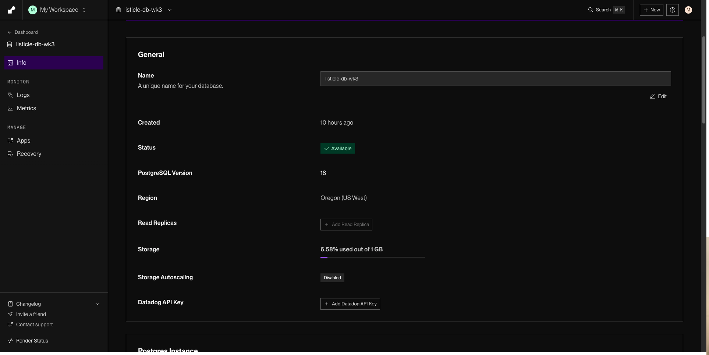

# WEB103 Project 3 - *Dev Community*

Submitted by: **Mohtashim Syed**

About this web app: **A virtual community space for developers, added as a new "Community" tab on the existing Dev Tools site. Users explore the city through a visual grid of location cards (a tech hub, coworking lofts, a maker space, and more) and click any location to open its own page, which lists all of that venue's events — meetups, workshops, and hackathons — split into upcoming and past. The data lives in a PostgreSQL database on Render (`locations` ──< `events`) and is served through an Express JSON API; the frontend fetches from that API and renders the pages.**

Time spent: **3** hours

## Required Features

The following **required** functionality is completed:

<!-- Make sure to check off completed functionality below -->

- [ ] **The web app uses React to display data from the API**
  - ⚠️ Built with **vanilla HTML/CSS/JS (no framework)**, consistent with Project 1 & 2. The data still flows from the API to the frontend via a `services/` fetch layer — but it is not React. See Notes.
- [x] **The web app is connected to a PostgreSQL database, with an appropriately structured Events table**
  - [x]  **NOTE: Your walkthrough added to the README must include a view of your Render dashboard demonstrating that your Postgres database is available**
  - [x]  **NOTE: Your walkthrough added to the README must include a demonstration of your table contents. Use the psql command 'SELECT * FROM tablename;' to display your table contents.**

Render dashboard showing the PostgreSQL database **Available**:


- [x] **The web app displays a title.**
- [x] **Website includes a visual interface that allows users to select a location they would like to view.**
  - [x] *Note: A non-visual list of links to different locations is insufficient.*
  - The Community page renders each location as an **image card** in a responsive grid.
- [x] **Each location has a detail page with its own unique URL.**
  - e.g. `localhost:3000/locations/tech-hub-downtown`, `localhost:3000/locations/maker-space-north`.
- [x] **Clicking on a location navigates to its corresponding detail page and displays list of all events from the `events` table associated with that location.**

The following **optional** features are implemented:

- [ ] An additional page shows all possible events
  - [ ] Users can sort *or* filter events by location.
- [ ] Events display a countdown showing the time remaining before that event
  - [x] Events appear with different formatting when the event has passed (ex. negative time, indication the event has passed, crossed out, etc.).
    - Events are grouped into **Upcoming** and **Past**; past events get a "Past" badge and are visually de-emphasized.

The following **additional** features are implemented:

- [x] Built as a **new tab of the same website** — a Community nav link sits alongside the existing Dev Tools listicle, sharing one database, server, and stylesheet without touching the existing routes
- [x] Each location card shows a live **event count**, computed in SQL with a `LEFT JOIN ... GROUP BY`
- [x] **MVC-style backend**: thin routes (`routes/locationsRouter.js`) delegate to controllers (`controllers/locationsController.js`, `controllers/eventsController.js`) that hold all the SQL
- [x] Dedicated client **`services/locationsAPI.js`** fetch layer (`fetchLocations`, `fetchLocationBySlug`, `fetchEventsByLocation`)
- [x] Clean **404** handling for unknown location slugs, plus a friendly not-found state on the location page
- [x] All dynamic values are HTML-escaped before rendering to prevent injection

## Video Walkthrough

Here's a walkthrough of implemented required features:


GIF created with
[Kap](https://getkap.co/) for macOS


## Notes

**The React requirement.** This build uses **vanilla HTML/CSS/JS**, not React — carried over from the Project 1 & 2 frameless architecture. The data still flows API → frontend cleanly: `src/community.js` and `src/location.js` `fetch` from the Express JSON API through `src/services/locationsAPI.js` and render with template strings. Porting the two Community pages to React (e.g. a `LocationsPage` listing cards and a `LocationPage` showing events) would satisfy the rubric without changing the backend — the API contract stays the same.

**Architecture.** The Community feature reuses the existing split: a `client/` frontend and a `server/` Express + `pg` backend talking to a Render-hosted PostgreSQL database.

- **Pages** — `community.html` (the visual location picker) and `location.html` (a single location's detail page), served by `server.js` at `/community` and `/locations/:slug`.
- **API** — `GET /api/locations`, `GET /api/locations/:slug`, and `GET /api/locations/:slug/events`, mounted from `routes/locationsRouter.js`.

**Database design.** A normalized two-table schema, one venue to many events:

```
locations                       events
---------                       ------
id           SERIAL PK          id          SERIAL PK
slug         VARCHAR UNIQUE     title       VARCHAR
name         VARCHAR            location_id INTEGER → locations(id)  (FK, ON DELETE CASCADE)
neighborhood VARCHAR            starts_at   TIMESTAMPTZ
image        TEXT               host        VARCHAR
description  TEXT               description TEXT
```

Seeded with **5 locations** and **14 events** whose dates straddle "today," so each location page shows both upcoming and past events. Run `npm run db:reset` to (re)create and seed every table on Render.

**For the walkthrough**, the two required NOTE items above are demonstrated by:
- showing the Render dashboard with the database **Available**, and
- running `psql <External Database URL> -c "SELECT * FROM events;"` (and `locations`) to display the table contents.

**Challenges.**
- Splitting events into upcoming/past meant computing "now" once on the client and comparing each event's `starts_at`, so the boundary stays consistent across the whole render.
- Keeping the new tab fully additive — sharing the database, Express server, and `style.css` with the Dev Tools listicle while not touching its existing behavior.
- Location photos use stable [picsum.photos](https://picsum.photos) placeholders (no API key, reliable hotlinking); swapping in real venue photos is just a data change in `config/data.js`.

## License

Copyright 2026 Mohtashim Syed

Licensed under the Apache License, Version 2.0 (the "License"); you may not use this file except in compliance with the License. You may obtain a copy of the License at

> http://www.apache.org/licenses/LICENSE-2.0

Unless required by applicable law or agreed to in writing, software distributed under the License is distributed on an "AS IS" BASIS, WITHOUT WARRANTIES OR CONDITIONS OF ANY KIND, either express or implied. See the License for the specific language governing permissions and limitations under the License.
